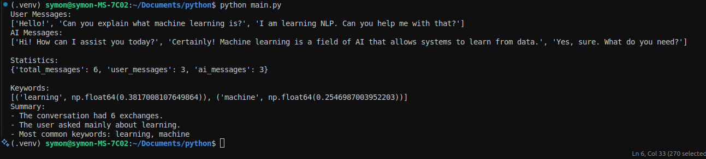
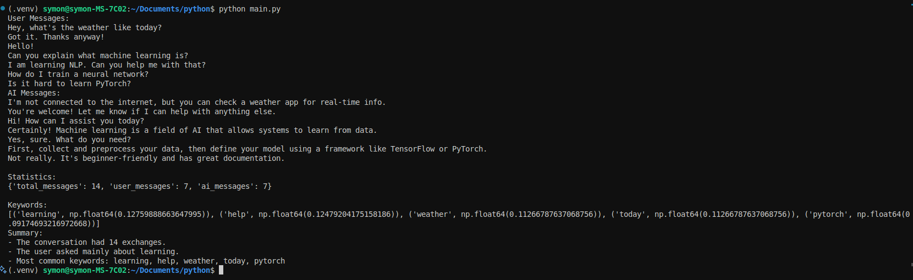

# AI Chat Log Summarizer
This project extracts the most relevant keywords from a conversation between a user and an AI using **TF-IDF (Term Frequency-Inverse Document Frequency)**. It's useful for **summarizing topics**, **tagging conversations**, or **analyzing user interests**.

---

## Features

- Separates and processes messages from both **user** and **AI**
- Converts messages to **TF-IDF vectors**
- Extracts top **N keywords** based on average importance across all messages
- Simple to run, easy to understand, and extendable

---


---

## Sample Input (chat.txt)

```txt
User: Hello!
AI: Hi! How can I assist you today?
User: Can you explain what machine learning is?
AI: Certainly! Machine learning is a field of AI that allows systems to learn from data.
User: I am learning NLP. Can you help me with that?
AI: Yes, sure. What do you need?
```

## Sample Output 
```
User Messages:
['Hello!', 'Can you explain what machine learning is?', 'I am learning NLP. Can you help me with that?']
AI Messages:
['Hi! How can I assist you today?', 'Certainly! Machine learning is a field of AI that allows systems to learn from data.', 'Yes, sure. What do you need?']

Statistics:
{'total_messages': 6, 'user_messages': 3, 'ai_messages': 3}

Keywords:
[('learning', np.float64(0.3817008107649864)), ('machine', np.float64(0.2546987003952203))]
Summary:
- The conversation had 6 exchanges.
- The user asked mainly about learning.
- Most common keywords: learning, machine
```

## Screenshot

### For one chat.txt


### For multiple chat.txt in Assignment



## Run Locally
Clone the project 
```
git clone https://github.com/its-symon/ai-chat-summarizer.git

```
Go to project directory
```
cd ai-chat-summarizer
```

Install dependencies

```
python3.11 -m venv .venv

source .venv/bin/activate
```


## Author

👤 **Symon**

- Github: [@sin1ter](https://github.com/sin1ter)
